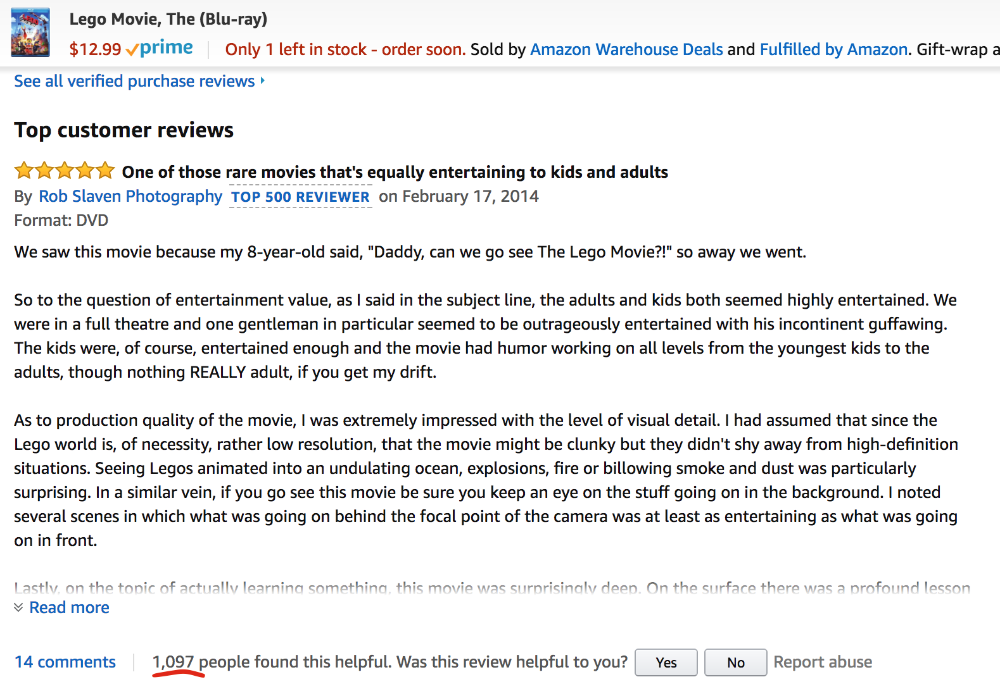
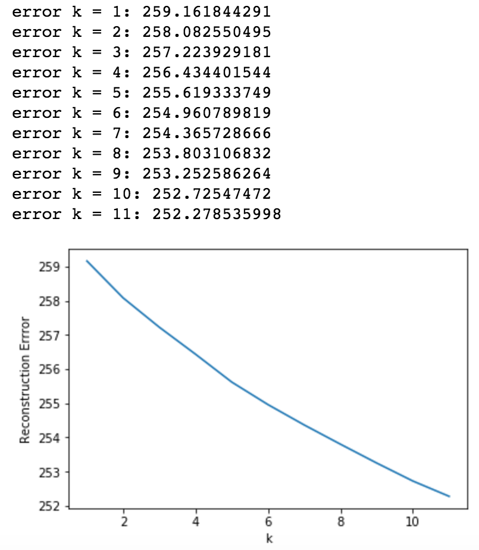
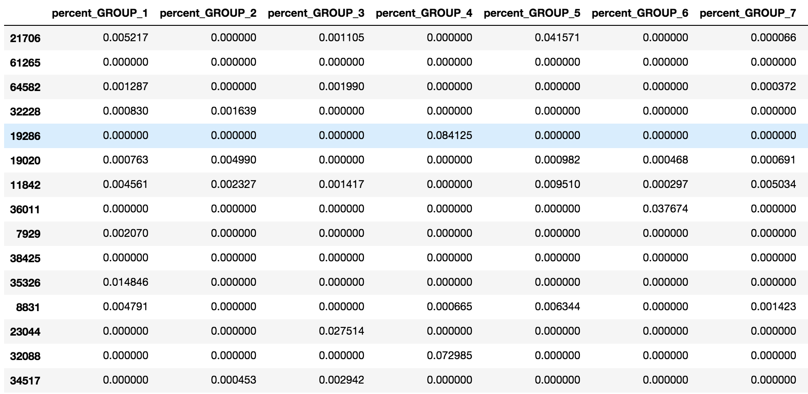

# Amazon_review_helpfulness_prediction
this is my repository for the Amazon Review Helpfulness prediction model project  
_last updated: 8/06/2017_  

## Repo Instructions

python folder:  
+ contains 1 python files  
   * data_prep_new.py contains all function used for this project  
   
Procedure.ipynb  
+ Jupyter notebook that runs python codes above. note that there is no data stored in this repo.

images  
+ jpeg images used in this readme markdown file.  

## Introduction:  

When you shop in Amazon, Do you notice that product reviews are in the order of helpfulness of reviews?  
This helpfulness is based on user's votes. If Amazon users find a product review helpful,  
users can simply leave positive votes on that review.  
the review with most positive votes gets placed as "Top Customer Reviews" on the product page by Amazon.  
  
Here is an example from actual Amazon website:  
  
  
  
-------------------
  
My question is:  
**Can Machine learning model learn characteristics of good customer reviews and predict helpfulness of reviews?**  
   
To answer this question, I used Amazon review dataset from [Julian McAuley's website](http://jmcauley.ucsd.edu/data/amazon/links.html)  
and built a xgboost ensemble method model that identify each review as highly helpful or not helpful.  
  
The definition of 2 label classes:    
Highly helpful reviews = Amazon reviews with more than 75% of votes being positive (= helpful)  
Not helpful reviews = Amazon reviews with less than 75% of votes being positive  
  
**With high prediction accuracy, I can determine helpful reviews regardless of user votes on Amazon.**  
  
## Results  
  
Dataset used:  
Home & Kitchen  
Training data: # of reviews = 20,000  
Test data: # of reviews = 3,823      
  
#### 1. XGBOOST result
Overall prediction accuracy: 77.24%     
Confusion Matrix:  
  
 |                 |       NOT HELPFUL TRUE       |        HIGHLY HELPFUL TRUE        |  
 |:--------------: | :-------------------:|:-----------------------:|  
 |       NOT HELPFUL PRED     |        1426.0        |           473.0        |  
 |        HIGHLY HELPFUL PRED     |        397.0        |           1527.0        |  
  
Not helpful review prediction rate: 78.22%  
Highly helpful review prediction rate: 76.35%  
  
#### 2. Random Forest result 
Overall prediction accuracy: 76.82%  
Confusion Matrix:  
  
|                 |       NOT HELPFUL TRUE       |        HIGHLY HELPFUL TRUE        |  
|:--------------: | :-------------------:|:-----------------------:|  
|       NOT HELPFUL PRED     |        1492.0        |           555.0        |  
|        HIGHLY HELPFUL PRED     |        331.0        |           1445.0        |  
  
Not helpful review prediction rate: 81.84%  
Highly helpful review prediction rate: 72.25%  
  
-------------------------
  
## Data used:

the original data and data unzipping function were created by Julian McAuley  
  
This dataset contains product reviews and metadata from Amazon,   
including 142.8 million reviews spanning May 1996 - July 2014.   
The dataset includes reviews (ratings, text, helpfulness votes),   
product metadata (descriptions, category information, price, brand, and image features),   
and links (also viewed/also bought graphs).  

For my prediction model listed here, I used Home & kitchen product dataset which contains:  
  1. 4,253,926 reviews  
  2. 436,988 products meta data  
  
I merged meta data and reviews and preprocessed data before running prediction model.  

  
## Preprocessing

#### flow  
1. merging meta data and reviews by product id
2. train,test split (need to do this before creating tfidf matrix for training dataset)
3. clean data (check for nulls) for both train and test
4. apply filters for both train and test
5. feature engineer for both train and test
6. check for features that only have 1 value (a column where all values are zero).  
    - identify these features in training set, and remove features from training and test dataset.  
  
  
#### Data cleaning  
1. Null values on the price feature were filled with average price values for each category.  
2. Null values on the sales ranking value feature were filled with average sales ranks for Home & Kitchen category products.  
  
#### Filters applied to the model  
   
  
Filters were applied to
1. product with null price values and null category sales ranking values  
2. product that belongs to categories that are less than 5000 when products data is groupby category.  

Left:  Here you are seeing a list of categories that Home & Kitchen products belongs to.  
The number represents total number of Home & Kitchen product in that category.  
As you can see, there are several categories that seems to be not related to  
Home & Kitchen products at all! (for example, Video Games)    
my filter is applied to take out these minor categories where total number is less than 5000.   
  
   
#### Feature engineering:  
There are over 1900 features at the end of preprocessing.  
During feature engineering, I added:  
1. NMF results in percentage (10 features where 10 = number of topics)  
   
  * To select NMF N topics, I used elbow method. However, the dataset did not plot obvious elbow.  
    I decided # of N based on the change in error rate and I found that the change becumes insignificant  
    after 10th topic.  

NMF result:  
  
values represents correlation between a review (row) and NMF groups.    

2. Tfidf terms (1000 features where 1000 = number of tfidf terms)  
3. name of sub categories (100 to 1000 features depending on the main category and filtering parameters)  
4. review text length, rating that reviewer gave to a product, price, categories,  
  sales ranking, percentage of review helpfulness (label) etc.

#### Label:   
HIGH,LOW

HIGH = Highly helpful reviews  
LOW = not helpful reviews  

## MODELS 
1. XGboost model  
  * parameter:
    1. N estimators = 2000
    2. Learning rates = 0.1
    3. subsample = 0.9
    4. Max Depth = 25
    5. gamma = 0.3
    6. colsample_bytree =0.8
    7. reg_alpha=0.01
  * This parameter setting maximized my result with the home & kitchen dataset.  
    you would need to find out different setting if you are working with different dataset.  

#### Parameter setting
I initially had only estimators and learning rates for my Xgboost parameters　　
but I decided to dig deeper and optimize my result.  
　　
I tested Max depth and subsamples and ran kfold after finding comfortable values for the two.　　
the k-fold result showed that I was slightly overfitting (gave me the accuracy of around 79% as the best score)　　
so I ended up adding gamma, reg_alpha, colsample_bytree to regularize and test if I can increase the overall accuracy. 　　 

results of parameter optimization:  
initial results:  
75.3% overall accuracy  

final results:　　
77.2% overall accuracy  　

Not a lot of improvement was made for amount of time spent on this parameter optimization　　
but I guess that is typical when working on xgboost parameterization.  
  
2. Random Forest model  
  * parameter:  
    1. N estimators = 1000  
    2. Max Features = 50  
    
-----------------
#### 1. XGBOOST result  
Overall prediction accuracy: 77.24%     
Confusion Matrix:  
  
 |                 |       NOT HELPFUL TRUE       |        HIGHLY HELPFUL TRUE        |  
 |:--------------: | :-------------------:|:-----------------------:|  
 |       NOT HELPFUL PRED     |        1426.0        |           473.0        |  
 |        HIGHLY HELPFUL PRED     |        397.0        |           1527.0        |  
  
Not helpful review prediction rate: 78.22%  
Highly helpful review prediction rate: 76.35%  
  
#### 2. Random Forest result 
Overall prediction accuracy: 76.82%  
Confusion Matrix:  
  
|                 |       NOT HELPFUL TRUE       |        HIGHLY HELPFUL TRUE        |  
|:--------------: | :-------------------:|:-----------------------:|  
|       NOT HELPFUL PRED     |        1492.0        |           555.0        |  
|        HIGHLY HELPFUL PRED     |        331.0        |           1445.0        |  
  
Not helpful review prediction rate: 81.84%  
Highly helpful review prediction rate: 72.25%  
  
-------------------------
　　
## Findings:  
- Random Forest model tends to have high accuracy in predicting not helpful reviews compare to highly helpful reviews.  
- Even though overall accuracies of xgboost and random forest model are about the same, xgboost model predicted highly helpful reviews 4% more than random forest model with good amount of parameter optimization.  
- important features from XGBoost model tell us that:  
  1. rank_values are important. I am guessing that there are worse reviews for more popular items.  
  2. percent_GROUP_10 is one of my NMF results that grouped words from reviews with high rating. Meaning that it only contains words that represents positive sentiment of reviewers.  
  3. multiple tfidf terms were my top features. I am not sure how these words influence quality of reviews but it seems like there is some connections that people don't see.  
  4. I am not sure how price of product influenced prediction but there have to be some correlation between quality of reviews and price of items. My guess is that reviews of expensive items tend to get helpful votes more than less expensive items.  
  
**XGBoost model's top15 most important features:**  
percent_GROUP_5 : 1.06626739725%  
overall : 1.06887128204%  
tfidf term "plan" : 1.08449421823%  
tfidf term "tank" : 1.10662672669%  
tfidf term "canister" : 1.14698605612%  
tfidf term "unit" : 1.20166642591%  
tfidf term "bring" : 1.30321569741%  
percent_GROUP_3 : 1.35008459911%  
tfidf term "firm" : 1.64041146636%  
percent_GROUP_8 : 1.82528309524%  
percent_GROUP_1 : 2.2015362978%  
text_length : 3.62322628498%  
percent_GROUP_10 : 3.6336414516%  
price : 3.9552140981%  
rank_values : 4.77411784232% 

 **RF model's TOP15 most important features**  
tfidf term "sturdy" : 0.584678335779%  
tfidf term "away" : 0.585385341721%  
percent_GROUP_3 : 0.595985233692%  
tfidf term "plan" : 0.603078315879%  
tfidf term "canister" : 0.615096497908%  
percent_GROUP_8 : 0.836280530402%  
percent_GROUP_1 : 0.875366369339%  
percent_GROUP_10 : 0.878284937356%  
tfidf term "firm" : 0.893000387224%  
tfidf term "loud" : 0.968729776675%  
rank_values : 1.06398524065%  
tfidf term "main" : 1.17321765229%  
price : 1.29460566953%  
text_length : 2.83935230228%  
overall : 8.2429583893%  

## Future work　　
Adding features:　　
  - n-gram tfidf terms, NMF results　　
    - probably the good starting point is playing with sklearn tfidfvectorizer and use different n-gram setting  
      and run NMF with that tfidf-matrix. 　　
    - Other option is to use textacy (textacy.extract.ngrams).　　
    
Reducing features:　　
  - I think I can reduce dimensionality and increase overall accuracy by reducing less important features from my dataset.  
  - My hope is to find a systematic way of finding these features and put additional steps to drop these features rather than finding least important features and droping last 50 features or 100features.  
  
Working with bigger dataset/major category:  
 - with more products and more reviews, I believe my nlp method works better.  
 - I just need better AWS instances or set up spark or hadoop that runs with AWS slave instances.  
   
   
## Other:  
### NMF result for Home & Kitchen products:
Top 20 words found in each NMF groups  
Topic #1:  
machine blender ice use make juicer juice cream bowl mixer clean blade easy food bread time fruit smoothie good dough  
Topic #2:  
coffee cup water maker machine brew filter grind carafe grinder espresso hot ground pot make bean use pour mug taste  
Topic #3:  
vacuum carpet floor clean dyson dirt bag suction hair brush dust cleaner attachment hose use canister pick hoover vac filter  
Topic #4:  
knife blade sharp set sharpen cut edge chef sharpener handle slice steel block use henckel wusthof good steak hand dull  
Topic #5:  
pan stick cook non use heat cookware pot egg set oil iron food grill handle cast skillet clean surface calphalon  
Topic #6:  
mattress bed pillow sleep sheet foam memory pad night topper soft comfortable feel firm cover like smell queen wake good  
Topic #7:  
rice cooker cook pot pressure slow brown cooking steam cup water lid time use warm crock food make steamer minute  
Topic #8:  
unit fan air room water heater filter heat cool run window temperature work low turn quiet use high noise setting  
Topic #9:  
oven toaster toast bread cook pizza convection bake bagel use microwave timer rack slice burn heat setting time door tray  
Topic #10:  
product buy look item amazon use good like make purchase order review work return set say price quality time great  
  
The NMF result shows that NMF splits reviews by type of Home & Kitchen product that user reviewed (topic #1 through #9).  
The Topic #10 seems to be the NMF group for reviews with positive user sentiment and
my models show that reviews that are highly correlated to this topic tend to be highly helpful reviews.   
  
   
### Computation times  
I used single m4.2xlarge AWS instance to run my codes.  
Preprocessing took about total of 2500-3000 sec. (= about 40-50min)  
  
with my training dataset (20000 rows with 1900 features):  
single xgboost computation took about 2000-3000 sec.(=about 30-50min)   
If I restrict max_depth to  the default value of 3, computation time should be around 500sec max.  
  
with only few parameters, random forest runs much quicker than xgboost,    
it took me only about 200sec.  
  
## Acknowledgement
I'd like to thank Julian McAuley for giving me an opportunity to use his dataset for this project.

## Resources:  
  
http://jmcauley.ucsd.edu/data/amazon/links.html  
J. McAuley, A. Yang. Addressing Complex and Subjective Product-Related Queries with Customer Reviews. WWW, 2016　
R. He, J. McAuley. Modeling the visual evolution of fashion trends with one-class collaborative filtering. WWW, 2016  
J. McAuley, C. Targett, J. Shi, A. van den Hengel. Image-based recommendations on styles and substitutes. SIGIR, 2015  
  
[Topic Modeling with scikit Learn ](https://medium.com/@aneesha/topic-modeling-with-scikit-learn-e80d33668730)  
  
[pycon-nlp-in-10-lines (Github)] (https://github.com/cytora/pycon-nlp-in-10-lines)  
  
